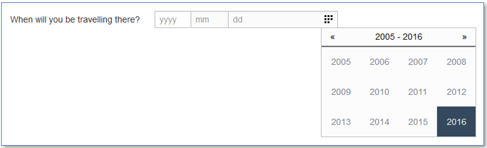
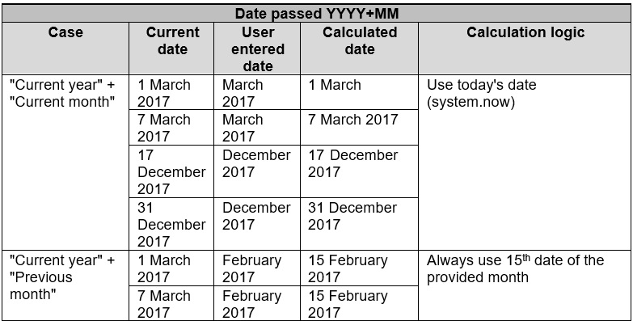
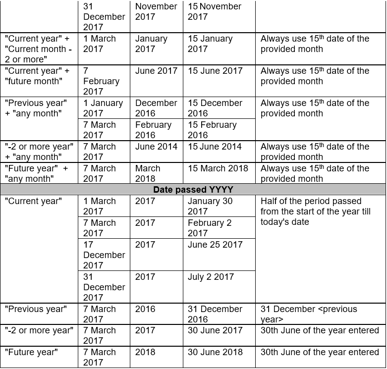

# C.T.CO QA  Assignment

## Coding Exercise:

Create a maven project that contains one test.
Test should be executed by 'mvn clean test' command.

### Steps:

1. Log in to https://ctco.lv/en page
2. Open Careers menu
3. Click Vacancies from the list.
4. Open vacancy with the title "Test Automation Engineer"
5. Verify that paragraph under Professional skills and qualification: contains exactly 5 skills. (skills are separated
   by br tag)

## Non-Coding Exercise:

From the steps from the above coding exercise, write few test cases for the personalinformation
page. This can be a separate document sent as part of the same solution.

### Advanced Date Picker:

This widget allows either typing a date in a textbox or choosing a date from a calendar widget.

User could enter Year only (YYYY), Year and Month (YYYY+MM) or Year, Month and Date (YYYY+MM+DD)

If only part of the date is entered by User, on submit partial date is automatically converted to full date by backend
and stored in DB. On GUI the original value entered by User is shown.

Logic of backend calculations with date examples

1. Please create TC design to cover this functionality;
2. Please define high-level automation strategy (short overview);
3. Please list most likely problems you could expect during such functionality testing.